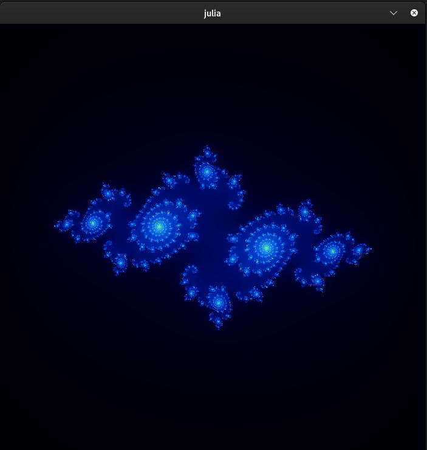
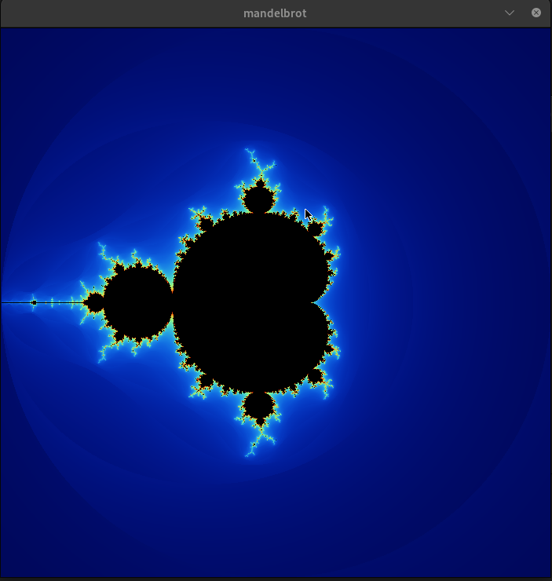
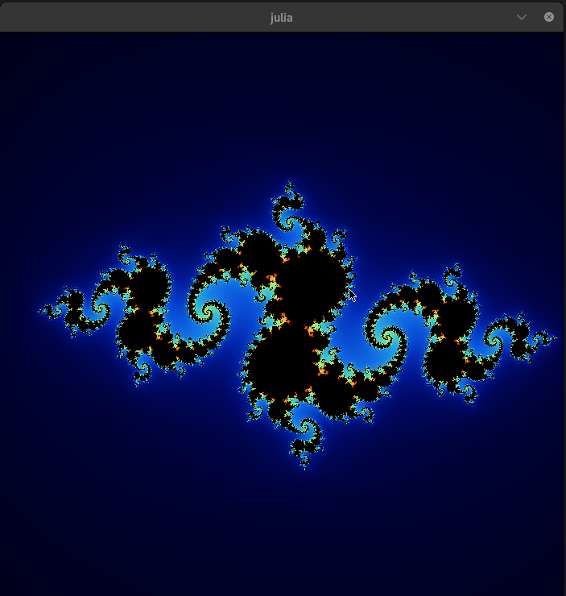

🌌 Fract-ol: A Stunning Fractal Renderer
========================================

Welcome to **Fract-ol**, a mesmerizing fractal visualization project! This program lets you explore the beauty of fractals, such as the **Mandelbrot Set** and **Julia Set** and **tricorn set**, with real-time zooming and panning features.\
*Example of a rendered Mandelbrot Set.*

* * * * *



📖 Table of Contents
--------------------

-   🖥️ About the Project

-   ⚙️ Features

-   📦 Installation

-   🚀 Usage

-   🎮 Controls

-   📸 Screenshots

-   🔧 How It Works

-   🤝 Contributing

-   📜 License

* * * * *

🖥️ About the Project
---------------------

**Fract-ol** is a fractal rendering program written in C using the **MiniLibX** graphics library. It allows users to visualize different fractals and interact with them through zooming and movement controls.

* * * * *

⚙️ Features
-----------

✅ Render **Mandelbrot** and **Julia** fractals in real time\
✅ Smooth zooming centered on the mouse cursor\
✅ Panning to explore different areas\
✅ Adjustable iteration depth for precision\
✅ Support for multiple color schemes\
✅ Keyboard and mouse interaction support

* * * * *

📦 Installation
---------------

To run **Fract-ol**, you need **MiniLibX** and a C compiler.

### **1️⃣ Clone the Repository**

```
git clone https://github.com/Is-ammar/fract-ol.git
cd fractol
```

### **2️⃣ Install MiniLibX (if needed)**

For macOS:

```
brew install minilibx
```

For Linux:

```
sudo apt install libx11-dev libxext-dev
```

### **3️⃣ Compile the Project**

```
make
```

* * * * *

🚀 Usage
--------

Run the program with the desired fractal type:

```
./fractol mandelbrot
```

```
./fractol julia <x> <y>
```
```
./fractol_bonus tricorn
```
Example for Julia with custom parameters:

```
./fractol julia -0.7 0.27015
```

* * * * *

🎮 Controls
-----------

### **Mouse Controls:**

🖱️ Scroll Up → Zoom In\
🖱️ Scroll Down → Zoom Out

### **Keyboard Controls:**

⬆️⬇️⬅️➡️ → Move around\
`C` → Change color scheme\
`ESC` → Exit program

* * * * *

📸 Screenshots
--------------

Here are some sample fractals rendered with **Fract-ol**:

  |  |

* * * * *

🔧 How It Works
---------------

### **Scaling & Mapping Pixels**

Each pixel is mapped to a point in the complex plane:

```
fractal->cx = (fractal->x / fractal->scale) + fractal->offset_x;
fractal->cy = (fractal->y / fractal->scale) + fractal->offset_y;
```

### **Zooming Logic**

The zooming function keeps the focus centered on the cursor:

```
fractal->offset_x += (x / fractal->scale) - (x / new_scale);
fractal->offset_y += (y / fractal->scale) - (y / new_scale);
fractal->scale = new_scale;
```

### **Escape Condition**

The fractal iterations determine whether a point belongs to the set:

```
while (++iterations < fractal->max_iterations)
{
    zx_squared = fractal->zx * fractal->zx;
    zy_squared = fractal->zy * fractal->zy;
    if (zx_squared + zy_squared >= 4.0)
        break;
    fractal->zy = 2.0 * fractal->zx * fractal->zy + fractal->cy;
    fractal->zx = zx_squared - zy_squared + fractal->cx;
}
```

* * * * *

🤝 Contributing
---------------

Got improvements or ideas? Feel free to fork and submit a pull request!

* * * * *

* * * * *

✨ *Enjoy exploring the beauty of fractals!* ✨
